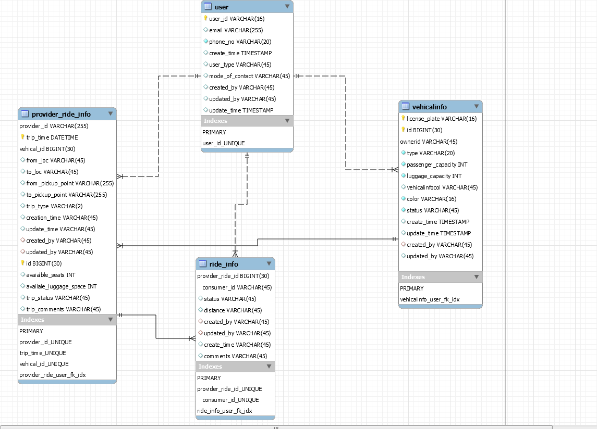

# DROP(Delta Rideshare Option for Personnel)

**ABSTRACT**

DROP(Delta Rideshare Option for Personnel) Car sharing is a good way to use up the full seating capacity of a car, which would otherwise remain unused if it were
just the driver using the car. Delta Rideshare application allows any Delta Employee or contractor registered for carpool without worrying about leaking private information 
to public. A user can register as ride provider or car rider. A rider can search available trips based upon location and time and reserve the trip. Notification will be sent 
to rider and driver once a trip is reserved. A trip can be canceled by a driver as well as rider. Real time notifcation will be sent.

**System Design and Architecture**

The following diagram shows the general system architecture

**DB Entity relationship diagram**
 
 
 
**Process Flow diagram**

  
  
  
**Resources for API rideshareapi**

* **/user**  This resource creates a user. A user can be a driver or rider             
* **/user/auth**    This resource authenticates a logging user using SSO       
* **/vehicle/search**    This resource lists all available vehicles information in the user area based on the user entered search criteria
* **/vehicle** This resource will register a new vehicle
* **/trip** This resource will be used to post a trip by driver
* **/trip/search**  This resource used to search all the available trips based on the search criteria
* **/trip/reserve**   This resource used to reserve a ride on a particular trip
* **/trip/cancel/{tripId}**   This resource used to cancle entire trip by driver
* **/rider/cancel/{tripId}/user/{userId}**   This resource used to cancel thier individual trip by a rider 
  
 **Resources for Notifcation MS**
 * **/notification/send** send notification
 * **/heath**  check health

## Deployment Steps To  Openshift SBX

* oc login https://sbx2con.paasdev.delta.com:443 --token=[your-openshift-login-token]
* oc run -i -t tool-box-example --image=quay.io/redhat-cop/tool-box:v1.2 --restart=Never --rm bash
* oc login https://sbx2con.paasdev.delta.com:443 --token=[your-openshift-login-token]
* ansible-galaxy install -r .applier/requirements.yml --roles-path=galaxy
* ansible-playbook -i .applier/inventory-sbx/ galaxy/openshift-applier/playbooks/openshift-cluster-seed.yml -e filter_tags=sbx
 